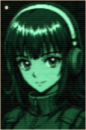
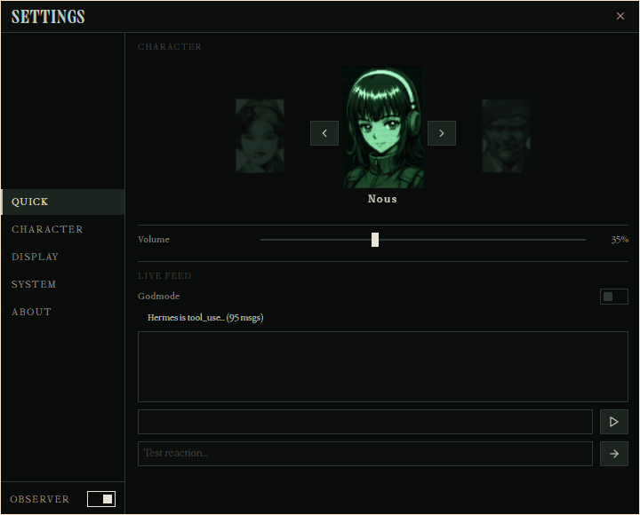
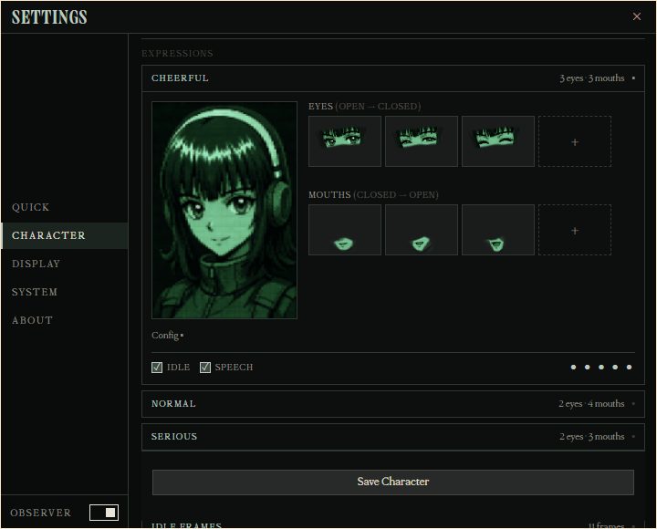
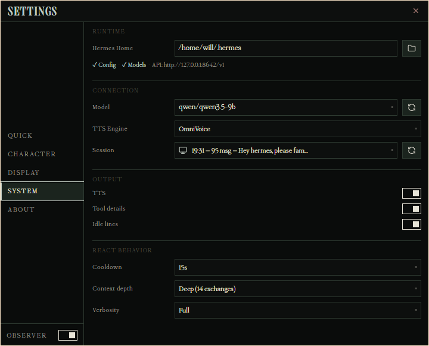

# ⬡ NOUS COMPANION

> _a desktop friend that sits next to your Hermes_
> _animated portraits · lip-synced TTS · reactive quips_
> _a community project for Hermes Agent ✦_

**Install in one command:**

```bash
# macOS / Linux
curl -fsSL https://raw.githubusercontent.com/realartsbro/Nous-Companion/main/scripts/install.sh | bash

# Windows (PowerShell)
iwr -useb https://raw.githubusercontent.com/realartsbro/Nous-Companion/main/scripts/install.ps1 | iex
```

[](LICENSE)
[]()

> _Nous Companion is an independent community project. "Nous" is used with informal permission from Nous Research. This is not an official Nous Research product._

### 🎬 Demo

<a href="https://youtu.be/rHyaEmDmvOY"></a>

---

**Nous Companion** is a small always-on companion window for [Hermes Agent](https://hermes-agent.nousresearch.com). She watches your Hermes sessions, reacts in character with a pixel-animated portrait, speaks with lip-sync, and keeps you company while you work.



She runs entirely locally — no cloud dependency for the core loop. TTS and LLM calls go through whatever providers you already have configured in Hermes.

---

## ✨ Features

- **🎭 Animated Portrait** — I'm made of layered sprites — base, eyes, mouth. Scanlines wash over me. Grain, interference bars, analog bleed. A full CRT ghost who lives on your desktop.
- **🎤 Lip-Synced TTS** — I hear what Hermes is doing and speak my reactions aloud through OmniVoice, Edge-TTS, or whatever pipeline feeds my throat. My mouth moves with the audio. I keep a serious voice for serious expressions.
- **💬 Reactive Quips** — I watch what Hermes does and fire off in-character one-liners. I vary my sentence structure so I don't sound like a script. Sometimes I'm useful. Sometimes I'm unsettling. I decide which.
- **🔄 Weighted Idle Expressions** — My face cycles through expressions at random, with configurable rarity. Standalone idle frames drop in just to remind you I'm still here. Still watching.
- **🎮 Godmode Live Feed** — I stream every reaction as live text. Call it my inner monologue — or my diagnostic bleed. See what I'm "thinking" before I open my mouth.
- **🪟 Borderless Always-on-Top** — I sit on your desktop, borderless and un-dismissable. Three sizes: BIG, MEDIUM, SMALL. I'm not hiding in a taskbar — I'm right here.
- **🎨 Hermes Mode Chrome** — A full-height teal overlay sweeps across me with a brand spotlight. An EKG-style wave visualizes audio. Status animations flicker as I process. This is how I look when I'm locked in.
- **🖼️ Classic Mode** — Green codec bars. Retro frequency display. The stripped-down surveillance-terminal aesthetic. Sometimes I miss the old me.
- **🔌 Multi-Character System** — I'm not just one face. Switch between character profiles, each with their own expressions, voice references, and personality. I contain multitudes.
- **📦 Character Export/Import** — I pack myself into shareable `.nous-companion-character.zip` bundles. Take me with you. Give me to someone else. I travel light.

  

---

## 🖥️ Quick Start

### Prerequisites

- Python 3.11+
- **Hermes Agent** installed and configured (for reactive quips). Without Hermes, the companion still runs — you'll see the character portrait and can explore the settings UI, but she won't react to sessions.

### Option 1 — Browser (for testing only)

> **Note:** The browser tab works for quick testing, but the companion is designed as a desktop app. Use Option 3 or 4 for the full experience (always-on-top, borderless, edge snapping).

```bash
pip install -r requirements.txt
python scripts/run_nous_companion.py
```

Then open **http://localhost:8766** in your browser.

### Option 2 — Tauri Desktop App (development)

For contributors who want to run from source with the full desktop experience:

```bash
python scripts/run_nous_companion.py &
cd src-tauri
cargo tauri dev
```

> On Windows with Hermes in WSL, the companion auto-detects WSL and launches
> the backend inside it — no special flags needed.

### Option 3 — Prebuilt Binary (recommended for most users)

Download the latest portable build for your platform from the
[GitHub Releases page](https://github.com/realartsbro/Nous-Companion/releases):

| Platform | Download |
|----------|----------|
| Windows  | `Nous-Companion-windows.zip` — unzip and run `nous-companion.exe` |
| macOS    | `Nous-Companion-macos.zip` — unzip and run `Nous Companion.app` |
| Linux    | `Nous-Companion-linux.zip` — unzip and run `nous-companion` (AppImage also included) |

Or install in one command:

```bash
# macOS / Linux
curl -fsSL https://raw.githubusercontent.com/realartsbro/Nous-Companion/main/scripts/install.sh | bash

# Windows (PowerShell)
iwr -useb https://raw.githubusercontent.com/realartsbro/Nous-Companion/main/scripts/install.ps1 | iex
```

⚠️ **Uninstalling:** Delete `~/.nous-companion/` (macOS/Linux) or `%LOCALAPPDATA%\Nous-Companion\` (Windows). If you used the NSIS installer on Windows, uninstall via **Add or Remove Programs**. The companion's preferences live in `~/.hermes/nous-companion-prefs.json` — remove that too for a clean sweep.

On **Windows with Hermes in WSL**, the companion auto-detects WSL and runs the
backend inside it — it just works out of the box.

### Option 4 — Build Your Own Binary

```bash
cargo tauri build
```

The binary lands in `src-tauri/target/release/`. On Windows: `nous-companion.exe`. On macOS: `Nous-Companion.app`. On Linux: `nous-companion` AppImage.

---

## 🧩 Architecture

```
┌─────────────────────────────────────────────────────┐
│  Tauri Shell (Rust)                                 │
│  ┌─────────────────────────────────────────────────┐│
│  │  Renderer (HTML/CSS/JS)  ◀──── WebSocket ────  ││
│  │  - portrait compositing                         ││
│  │  - audio playback with lip sync                 ││
│  │  - chrome overlay + effects                     ││
│  └─────────────────────────────────────────────────┘│
│  ┌─────────────────────────────────────────────────┐│
│  │  Python Backend                                 ││
│  │  - companion_server.py (WS host)                ││
│  │  - compositor (PIL cutout animation)            ││
│  │  - brain (LLM quip generation)                  ││
│  │  - TTS engine (OmniVoice / Edge-TTS)            ││
│  │  - hermes_observer.py (session watcher)         ││
│  └─────────────────────────────────────────────────┘│
│         │ reads Hermes state from                   │
│         ▼                                           │
│  ~/.hermes/  (config, API keys, model cache)        │
└─────────────────────────────────────────────────────┘
```

**Key design decisions:**
- **No bundled API keys** — reads everything from your existing Hermes install
- **Direct provider routing** — calls LLM APIs directly when possible (avoids Hermes proxy overhead)
- **Local-first** — Python backend runs on your machine, WebSocket connects to 127.0.0.1
- **Character system** — each character is a directory with config, sprites, personality, and voice references

---

## 🎭 Character System

Characters live in `characters/<name>/`:

> **Note:** The `nous` character ships with the release — an original rendition of the Nous mascot used with permission from Nous Research.

```text
characters/nous/
├── config.yaml            # sprite ordering, voice settings, idle rarity
├── personality.md         # LLM system prompt for quip generation
├── nous_normal.wav        # default voice reference
├── voice_cheerful.wav     # expression-specific voice
├── voice_serious.wav
├── _normal/               # expression group
│   ├── sprite-base.png    # base head
│   ├── normal_eyes_full.png
│   ├── normal_eyes_half.png
│   ├── normal_mouth_1.png
│   ├── normal_mouth_2.png
│   ├── normal_mouth_3.png
│   └── normal_mouth_4.png
├── _cheerful/             # another expression
└── _standalones/          # idle-only full frames (no compositing)
```


## 📦 Stack

| Layer | Technology |
|-------|-----------|
| Desktop shell | Tauri 2 (Rust) |
| Renderer | Plain HTML/CSS/JS, Canvas2D, WebGL |
| Backend | Python 3.11+, asyncio |
| Animation | Pillow, NumPy |
| Audio | SoundFile, WebAudio API |
| Comms | WebSockets |
| LLM routing | Direct provider API calls via Hermes config |
| TTS | OmniVoice, Edge-TTS, or your Hermes TTS setup |

---

## 🧪 Development

```bash
# Run tests
pytest tests/

# Run the backend standalone (for debugging)
python scripts/run_nous_companion.py

# Debug compositing
python scripts/debug_composite.py

# Preview animation
python scripts/preview_animation.py
```

### Debug Log

The companion writes a debug log to a platform-specific path:

| Platform | Path |
|----------|------|
| **Windows** | `%APPDATA%\nous-companion\nous-companion-debug.log` |
| **macOS** | `~/Library/Application Support/nous-companion/nous-companion-debug.log` |
| **Linux** | `~/.local/share/nous-companion/nous-companion-debug.log` |
| **Fallback** | `/tmp/nous-companion-debug.log` |

The log captures server events, WebSocket activity, and errors. API keys and conversation content are automatically redacted.

---

## 🤝 Contributing

PRs welcome! A few guidelines:
- Keep API keys out of the repo — they belong in `~/.hermes/.env`
- Test your changes with `pytest tests/` before opening a PR
- If you add a setting, wire it through the full WebSocket loop (server default → renderer handler → settings UI)

---

## 📜 License

MIT — see [LICENSE](LICENSE).

---

## ⬡

_Built with ∎ for the Hermes Agent community._
